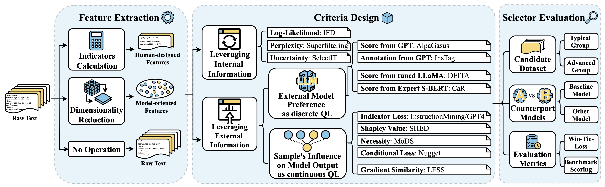
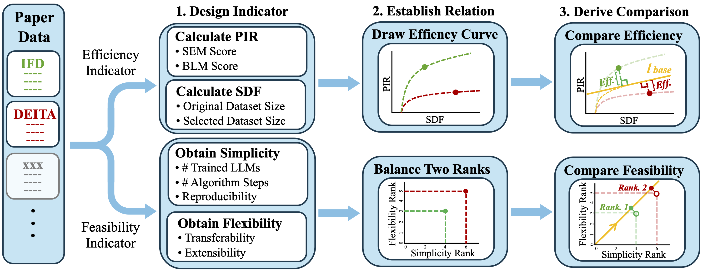
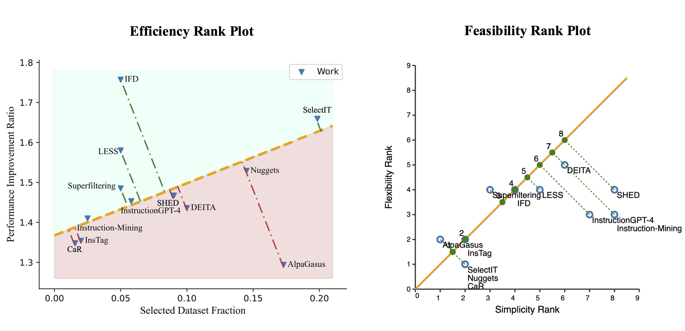

# Take the Essence and Discard the Dross: A Rethinking on Data Selection for Fine-Tuning Large Language Models

## ✨ Latest News
- [02/23/2025]: 🔨 Latest website and ranking algorithms addressed some minor errors in the **feasibility ranking plot** (Figure 5) and **feasibility rank table** (Appendix Table 5). Check out the updated Arxiv version [here](https://arxiv.org/pdf/2406.14115).
- [02/08/2025]: 🎉🎉🎉 Our paper has been accepted at **NAACL 2025**! The full paper is available [here](https://arxiv.org/pdf/2406.14115).
- [01/26/2025]: 👋 Our **TEDD-Ranker** visualization is now available! Check it out at [TEDD-Ranker](https://zicheliu.com/TEDD-Ranker/) with your own data selection methods!


## ⚡ Introduction
Quality matters more than quantity! Data selection for fine-tuning large language models has been a hit topic with various methods proposed over the last few years. For anyone intersted in the field or wish to develop new methods, some natural questions would be: **What are the existing methods** and **How good are they**?

Our work takes a retrospective look at a dozen key data selection techniques for fine-tuning LLMs, and introduces the following:

- A novel **three-stage scheme**, comprising **feature extraction**, **criteria design**, and **selector evaluation**, which systematically categorizes and evaluates these methods.

- a **unified comparison approach** that incorporates ratio-based efficiency and ranking-based feasibility metrics to address inconsistencies across evaluation settings.


These allow us to obtain a quantitative **Efficiency Rank Plot**, and a qualitative **Feasibility Rank Plot**.



---

However, there lacks a unified
Fine-tuning Large Language Models (LLMs) benefits significantly from selecting high-quality data rather than merely increasing dataset size. Our work introduces:

- A **three-stage framework** for data selection: **feature extraction, criteria design, and selector evaluation**.
- A **unified comparison approach** to measure data selection methods using **efficiency (Performance Improvement Ratio - PIR)** and **feasibility (flexibility and simplicity ranks)**.
- A ranking-based **TEDD-Ranker** that evaluates methods based on their efficiency-feasibility tradeoff.

Our key findings indicate that **targeted quality measurement leads to higher efficiency at the cost of feasibility**. Our **unified ranking approach provides a standardized comparison** across existing data selection methods.

<div align=center>

</div>

## 💡 Key Insights

1. **Efficiency vs. Feasibility Tradeoff**: The best-performing selection methods optimize **PIR**, but at the expense of general applicability.
2. **Three-Stage Framework**:
   - **Feature Extraction**: Extracts linguistic and model-oriented features.
   - **Criteria Design**: Defines internal and external quality labels.
   - **Selector Evaluation**: Assesses models via counterpart evaluations and win-tie-loss metrics.
3. **Unified Ranking System**: Provides **comparable rankings** based on a mix of **efficiency and feasibility indicators**.

## 🔗 TEDD-Ranker: Code & Visualization
We provide an **interactive visualization** of our method rankings and selection efficiency comparisons at:
🔗 [TEDD-Ranker Visualization](https://zicheliu.com/TEDD-Ranker/)

- **Efficiency Rank**: Performance Improvement Ratio (PIR) vs. Selected Dataset Fraction (SDF).
- **Feasibility Rank**: Simplicity and flexibility of each method.

*Note: The feasibility ranking table and feasibility rank plot contained minor errors in the original version. These are now corrected in the latest ArXiv update and TEDD-Ranker website.*

## 📈 Key Results


<div align=center>

</div>


## 🧐 Limitations

- **Error Corrections**: Our feasibility ranking plot (Appendix Figure 5) had **minor ranking errors** in early versions. The website and **latest ArXiv version** are now correct.
- **Ongoing Updates**: TEDD-Ranker is evolving. We welcome feedback and **will update rankings with new datasets/methods**.
- **Contact for Fixes**: If you spot any inconsistencies, **email archerliu@berkeley.edu or treefrogorigami@gmail.com**. Confirmed errors will be corrected and updated.

## 🤝 Acknowledgements
This research is supported by:
- The School of Data Science, **The Chinese University of Hong Kong, Shenzhen**.
- **Shenzhen Research Institute of Big Data**.

## 📜 Citation
```bibtex
@article{liu2024take,
  title={Take the essence and discard the dross: A Rethinking on Data Selection for Fine-Tuning Large Language Models},
  author={Liu, Ziche and Ke, Rui and Jiang, Feng and Li, Haizhou},
  journal={arXiv preprint arXiv:2406.14115},
  year={2024}
}
```
<!-- 
## ⭐ Star History
<a href="https://star-history.com/#tREeFrOGcoder/TEDD-Ranker&Date">
  <picture>
    <source media="(prefers-color-scheme: dark)" srcset="https://api.star-history.com/svg?repos=tREeFrOGcoder/TEDD-Ranker&type=Date&theme=dark" />
    <source media="(prefers-color-scheme: light)" srcset="https://api.star-history.com/svg?repos=tREeFrOGcoder/TEDD-Ranker&type=Date" />
    
  </picture>
</a> -->

